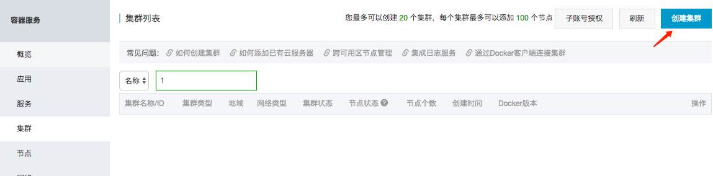
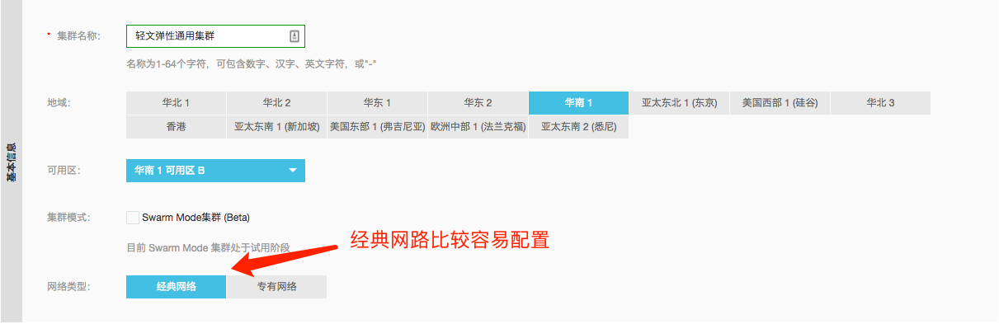
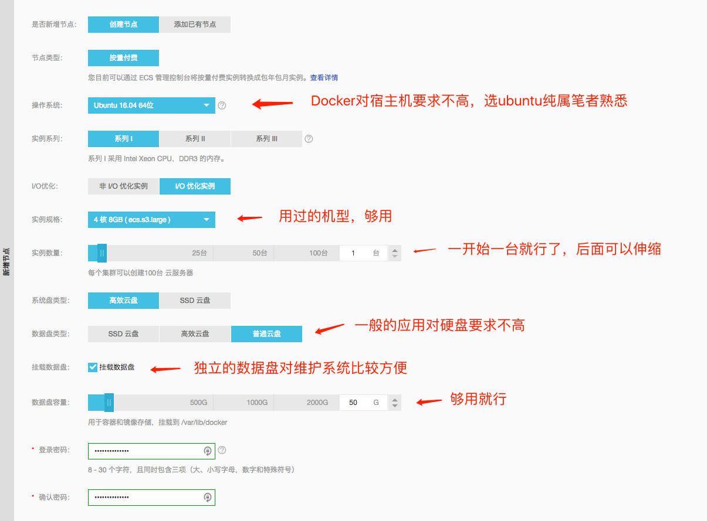
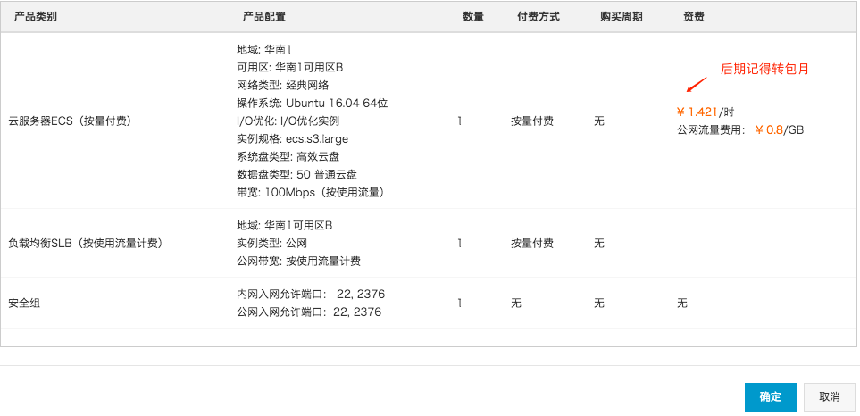
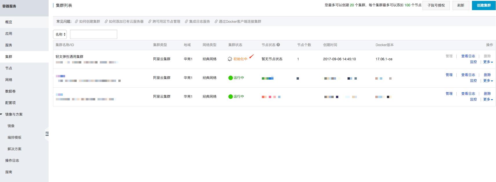

# 创建宿主机集群

之前配置好的Docker容器们终于可以跑在云端了，那么我们开始在阿里云操作吧。

首先进入阿里云容器服务: https://cs.console.aliyun.com

点击创建集群，去创建容器运行的宿主机。

然后按照图示去设置宿主机的配置。（看不清的话可以点右键在新标签页查看图片）

然后点击右边的[创建集群]，在下面的弹窗中点击确认。

那么集群就开始按照你的设置自动初始化了。

这个时候可以去喝一杯咖啡，或者进入到下一个步骤。
