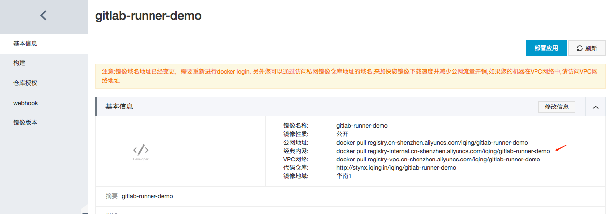
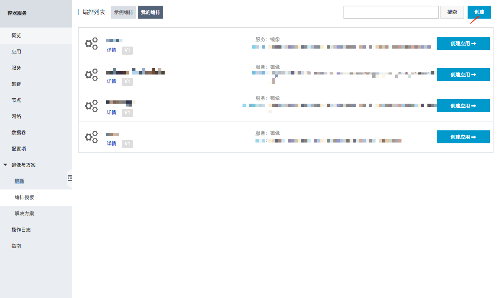

# 创建编排模板

编排模板是用来描述Docker各种运行参数的配置文件。

这是我们这次用到的样例:

```
runner-demo:
  image: '刚才构建好的镜像的内网地址'
  restart: always
  labels:
    aliyun.scale: '1'
  volumes:
    - '/var/run/docker.sock:/var/run/docker.sock'
```

image是刚才构建好的镜像的内网地址



aliyun.scale：应用启用的实例个数，这里一个就够了，以后可以加。

volumes：[把宿主机的Docker接口暴露给子容器](./gitlab-ci-run.html)，目的是启动新的执行容器。

如果要反复使用，可以在编排模板的功能里保存起来



编排模板有支持各种各样的参数, 可以参阅[官方文档: 创建编排模板](https://www.alibabacloud.com/help/zh/doc-detail/26011.htm)
