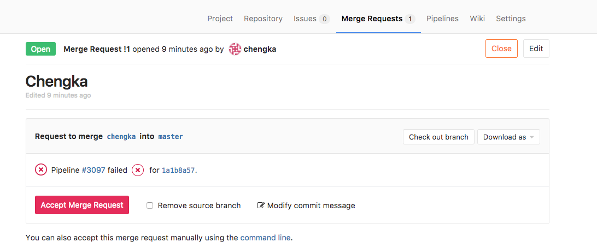
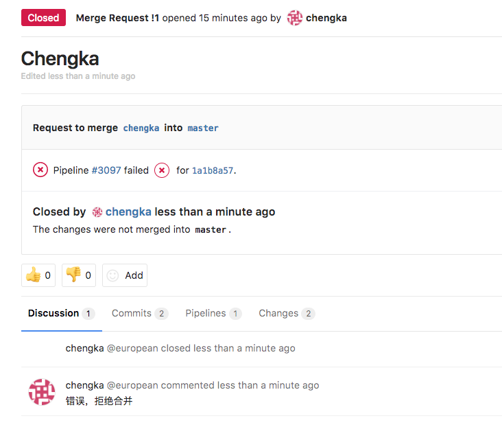

# 让CI跑起来

### 现在本地跑起来测试一下，为后面的演示提供Runner支持。

```
docker run -it -v /var/run/docker.sock:/var/run/docker.sock --rm gitlab-runner:v2
```

请注意这个参数:```-v /var/run/docker.sock:/var/run/docker.sock```这里是把宿主机的Docker进程暴露给了子容器。

为了避免出现在Docker里启动Docker的问题，我们让Runner启动测试Docker的时候实际上是在宿主机上开一个新的Docker容器。

这个容器和Runner的容器是平级的。

#### Merge Request与CI

我刚才新建一个分支叫Chengka，修改代码故意让测试挂掉。

然后使用Merge Request申请合并到master。



点进去看一下执行的详情。


测试结果挂掉的结果直观的显示了出来，这里就是我强烈推荐Gitlab CI的原因。 我可以在这里立刻拒绝这次提交。



然后我再把代码改对一次试试。

再点进去看一下执行的详情，成功。


然后就同意这次提交，合并到Master分支。


那么我们就完整的演示了一次，CI是怎么配合Merge Request对Master分支进行保护的了。

（未完待续...)
