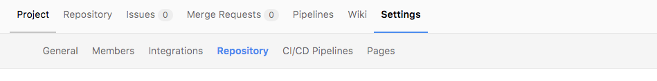
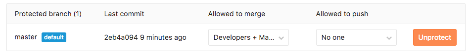

# 配置GitLab CI

官方文档: https://docs.gitlab.com/ee/ci/quick_start/README.html

老的版本GitLab CI是独立安装的，不过高版本的GitLab已经整合了GitLab CI，这里我们只需要配置一下就行了。

假设你已经在Gitlab上创建好了项目。

为了方便展示代码，我在Github上创建了一个[demo项目](https://github.com/iqing-devteam/ci-demo)

#### 设置分支保护





这里将master分支保护了起来，只能接受开发人员Merge Request，但是不接受直接的push操作。

那么想要操作master的代码就必须通过CI的检测，然后才能合并进主分支了。

#### 设置CI任务

在项目下创建一个文件```.gitlab-ci.yml```用来定义CI任务。

```yml
# .gitlab-ci.yml
image: ruby:latest # 使用ruby:latest这个docker镜像作为测试环境
test:
  script:
    - ruby test_demo.rb # 执行分单元测试
```

当Merge Request的时候就是执行这个文件里的任务进行自动化测试。

这里我们定义了一个简单的Ruby单元测试作为例子。

虽然我们定义了脚本，但是执行这个脚本的话需要配置好GitLab Runner才能进行。

Gitlab自己是不会执行测试的。

#### [安装和配置GitLab Runner](../deploy/gitlab-runner.md)
