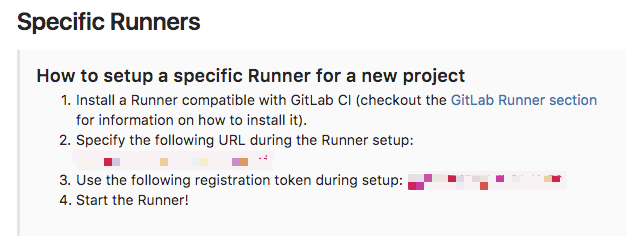

# 安装GitLab Runner

官方文档: https://docs.gitlab.com/runner/

GitLab Runner是CI任务的调度者，接到CI任务之后会呼叫Executor（执行者）去执行任务。

本方案让GitLab Runner在Docker内运行。当团队逐渐扩大的时候，CI的压力也会增加，那么直接扩展GitLab Runner的Docker容器是最好的选择。

下面是一种构建GitLab Runner的方法，一样是给出样例：[Demo项目仓库](https://github.com/iqing-devteam/gitlab-runner-demo)

## 创建Dockerfile

```bash
FROM ubuntu:14.04

COPY /sources.list /etc/apt/sources.list

RUN apt-get update -y && \
    apt-get upgrade -y && \
    apt-get install -y vim htop curl git git-man libedit2 liberror-perl libx11-6 \
    libx11-data libxau6 libxcb1 libxdmcp6 libxext6 libxmuu1 openssh-client patch \
    rsync xauth && \
    curl -sSL https://get.docker.com/ | sh

RUN  curl -L https://packages.gitlab.com/install/repositories/runner/gitlab-ci-multi-runner/script.deb.sh \
     | sudo bash && \
     apt-get install -y gitlab-ci-multi-runner

RUN apt-get clean && \
    rm -rf /var/lib/apt/lists/*

COPY /config.toml /etc/gitlab-runner/config.toml # 需要关注的重点

CMD ["gitlab-runner", "run", "python3-tester"]
```

## 创建config.toml

为了让GitLab去识别这个GitLab Runner，需要把这个项目先构建起来，然后完成注册的步骤。生成好config.toml之后就可以完成这个步骤了。

```bash
# 构建Docker
docker build -t gitlab-runner:v1 ./
```

构建的过程中打开项目的CI设置，从这里获取必要的资料。




这里打码的一个是Gitlab的地址，另一个是Gitlab的识别Token，后面的注册要用到。

构建完成之后启动刚才构建的Docker，然后开始注册

```bash
# 临时的启动这个Docker然后进入Bash，完成之后删除运行的容器。
docker run -it --rm gitlab-runner:v1 bash
```

在Docker容器内注册Runner

官方文档: https://docs.gitlab.com/runner/register/index.html

```bash
# 开始注册流程
gitlab-runner register
```

> Running in system-mode.
> Please enter the gitlab-ci coordinator URL (e.g. https://gitlab.com/):

这里输入刚才的拿到的地址

> Please enter the gitlab-ci token for this runner:

这里输入刚才的拿到的Token

> Please enter the gitlab-ci description for this runner:

给Runner起个名字

> Please enter the gitlab-ci tags for this runner (comma separated):

给Runner打个Tag，Tag是用来给项目特定Runner用的，这里暂时留空。

> Whether to lock Runner to current project [true/false]:
> [false]:

是否让这个Runner只给这个项目服务？ 这里选false. 我们这个Runner比较通用。

> Registering runner... succeeded                     runner=ppYbhAdF
> Please enter the executor: docker-ssh, parallels, virtualbox, docker+machine, docker-ssh+machine, kubernetes, docker, shell, ss

之前老提到的executor在这里出现了

官方文档: https://docs.gitlab.com/runner/executors/README.html

这里直接输入```docker```, 我们让测试的启动和结束都是在干净的虚拟环境里，这样很棒。

> Please enter the default Docker image (e.g. ruby:2.1):

这里设置默认Docker镜像，测试项目是Ruby，我就先指定为最新的ruby了```ruby:latest```

> Runner registered successfully. Feel free to start it, but if it's running already the config should be automatically > reloaded!

那么注册就完成了，现在我们要把注册流程生成的config.toml拿出来，这样方便我们更改配置

```bash
cat /etc/gitlab-runner/config.toml # 生成好的配置文件在Docker虚拟机的这个路径下
```

```
# config.toml
concurrent = 1
check_interval = 0

[[runners]]

  name = "ruby-tester"
  url = "https://example.com/ci"
  token = "******"
  executor = "docker"
  [runners.docker]
    tls_verify = false
    image = "ruby:latest"
    privileged = false
    disable_cache = false
    volumes = ["/cache"]
    shm_size = 0
  [runners.cache]
```

把内容复制到项目的config.toml里, 然后重建镜像

```bash
docker build -t gitlab-runner:v2 ./
```

#### [然后跑起来试一下](../deploy/gitlab-ci-run.md)
