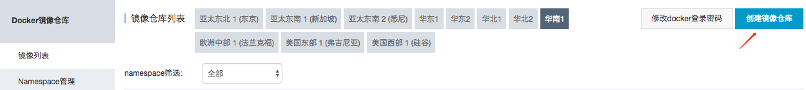
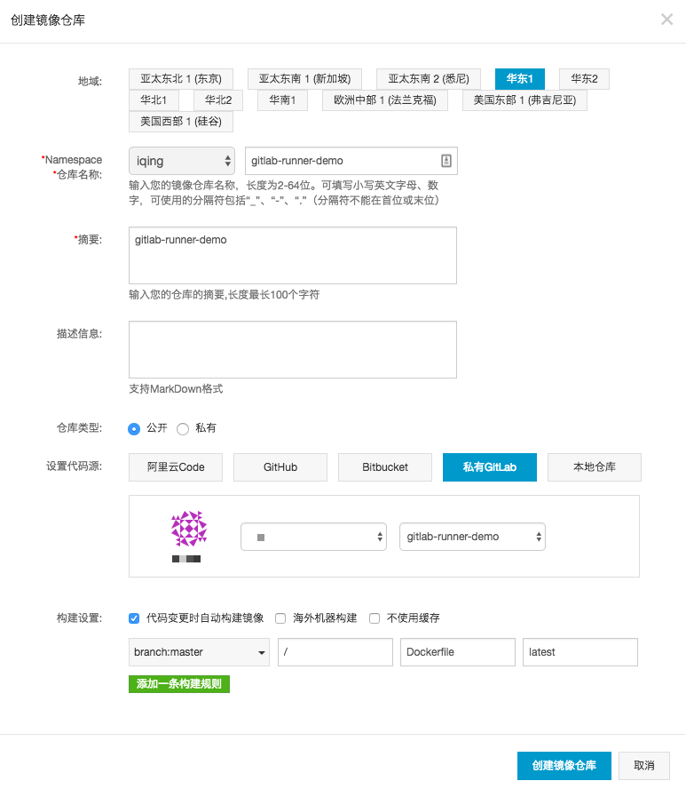
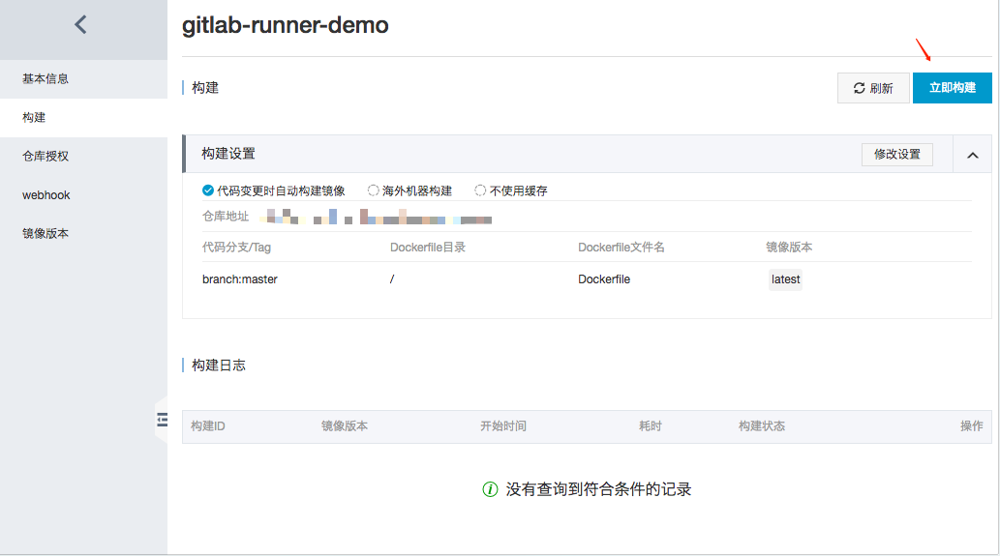
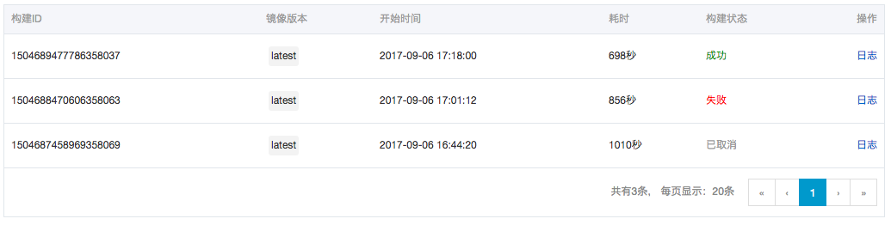

# 构建镜像

为了让每次编写的代码都能迅速构建成Docker镜像，我们需要使用阿里云Docker镜像仓库。

阿里云Docker镜像仓库: https://cr.console.aliyun.com

由于我之前已经绑定好了gitlab，你可以看一下这个[私有GitLab代码源的绑定](https://yq.aliyun.com/articles/69345)

点击创建镜像

在私有仓库中找到之前写好的[Runner docker](./gitlab-runner.html)。

第一次需要手动触发一下构建, 之后代码更新就会自动构建了。

因为涉及到一个境外源的下载，过程有点艰苦，不过最后还是搞定了。

