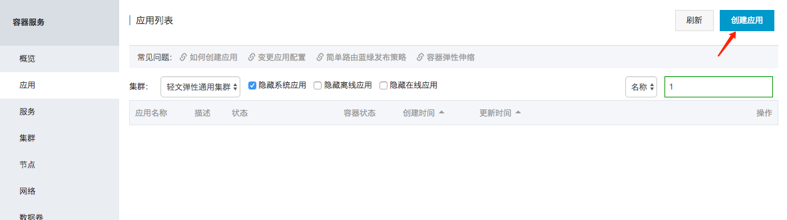
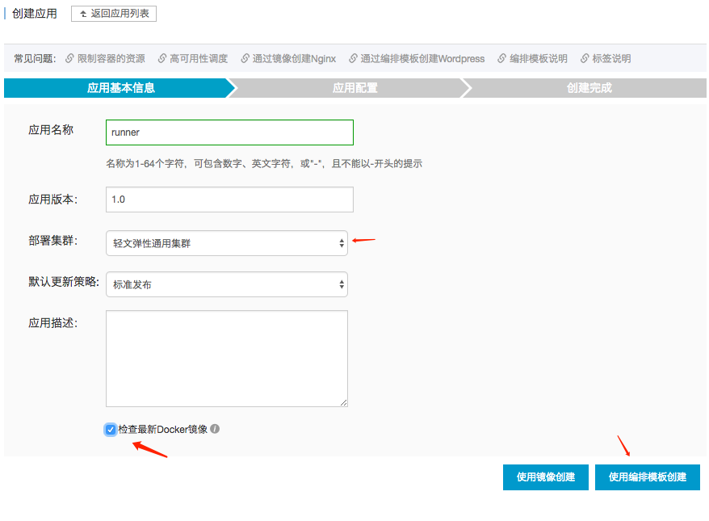
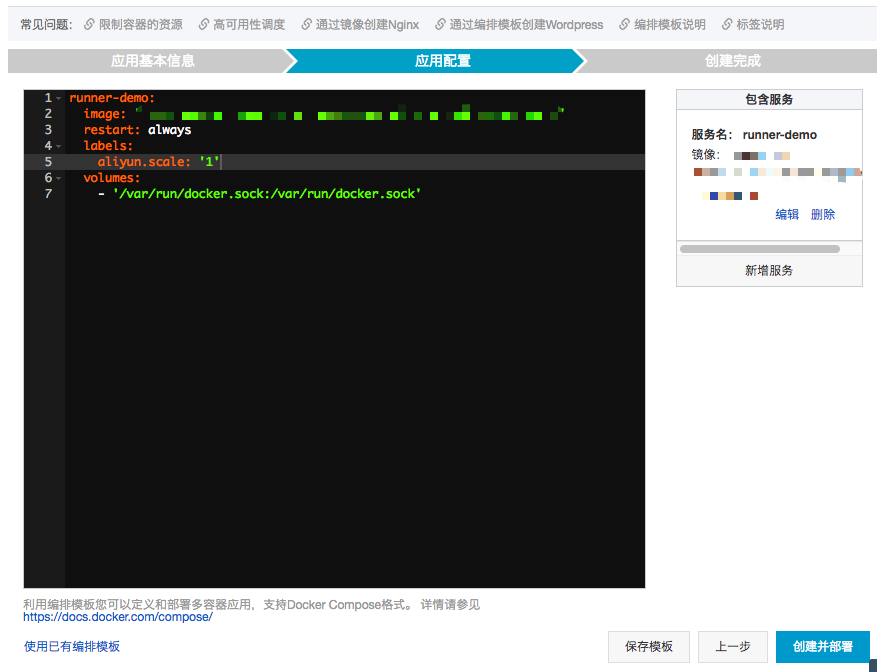
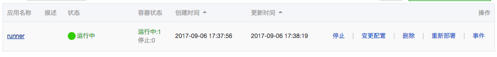
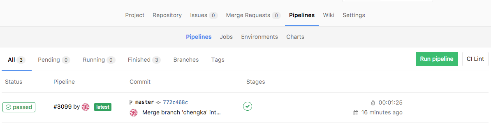
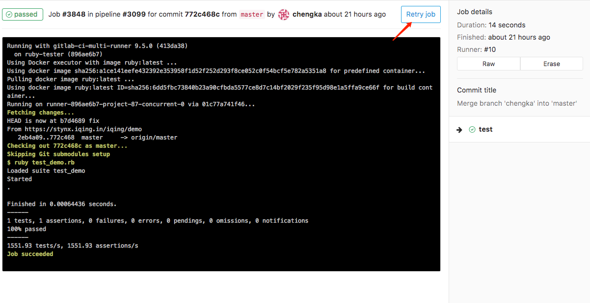
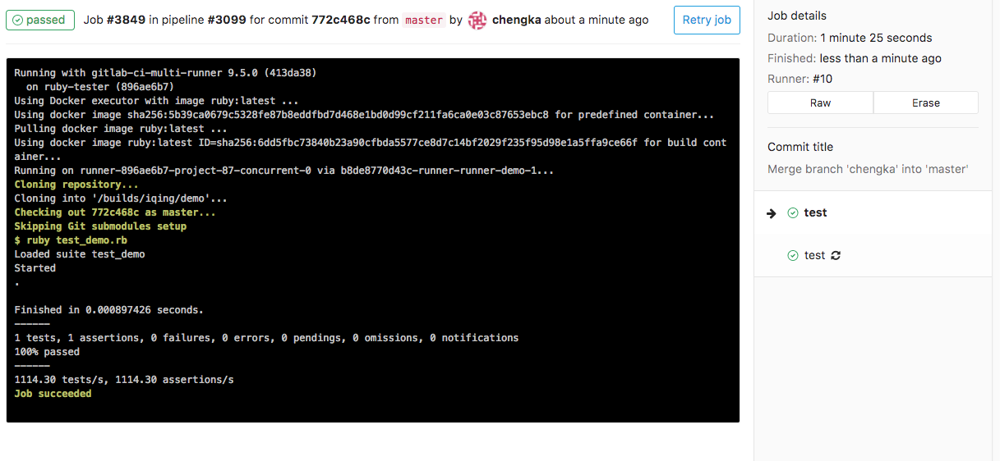
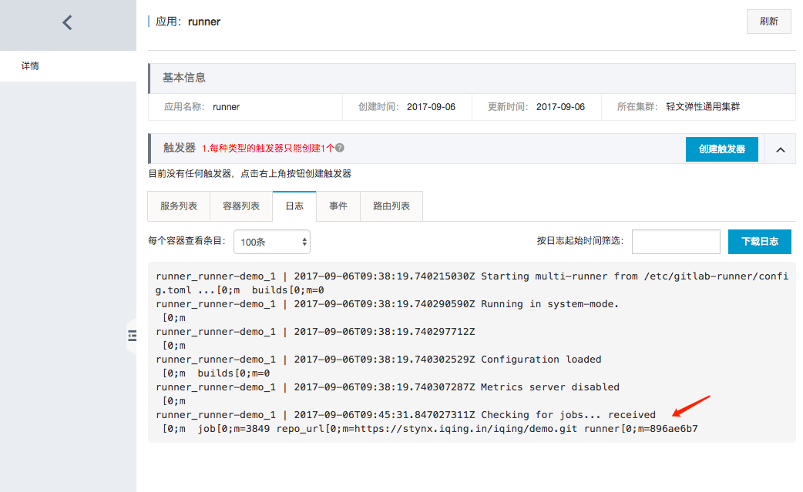

# 创建应用

那么运行前所有的准备都做好了，就等运行！

开始创建应用，去把Docker跑起来吧。

集群刚才新创建的，然后勾上检查最新镜像。

当新的镜像构建之后，应用就会自动更新了。

点击使用编排模板更新。

模板是上个步骤准备好的。

然后稍等一下，runner就跑起来了！

回到Gitllab，找到找到之前成功运行的CI任务。

点Retry重新运行一下，如果你本地启动了Runner一定记得关掉，确保只有阿里云上的在跑。

可以运行。

点到在阿里云容器服务的Runner应用里，看一下日志输出，也可能看到这个任务被分配到了这个应用上。

Double Check，任务完成

