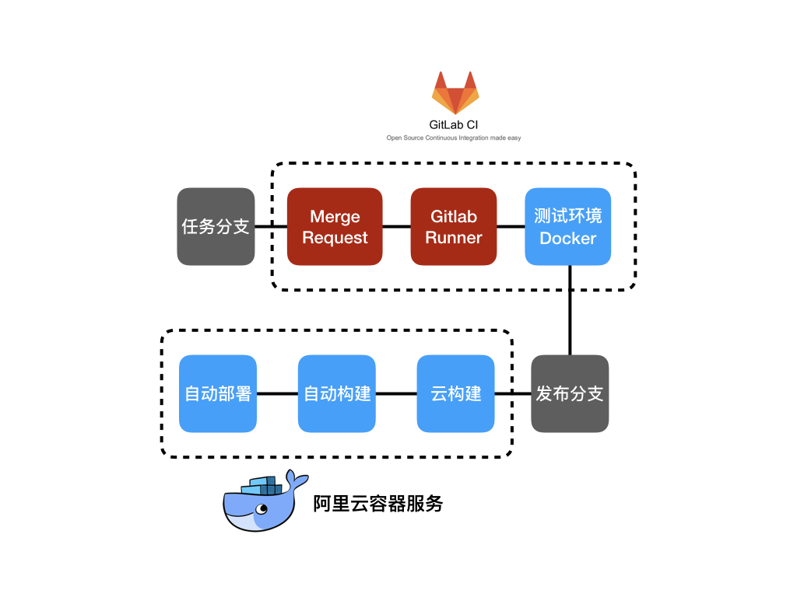

# 流程简介

1. [在任务分支上开发代码](#feature-branch)
2. [通过Merge Request，申请合并](#merge-request)
3. [通过对Gitlab CI的配置，Merge Request会触发Gitlab Runner去跑自动化任务](#gitlab-runner)
4. [Gitlab Runner启动指定的测试专用Docker去运行自动化测试](#gitlab-runner-executors)
5. [测试通过之后，将代码合并到master分支](#merge-master)
6. [阿里云容器仓库服务会检测到master分支的变更，开始构建新的docker镜像](#docker-build)
7. [阿里云容器服务会检测到docker镜像的变更，然后自动部署](#docker-deploy)

## 1. 在任务分支上开发代码

## 2. 通过Merge Request，申请合并

Merge Request是gitlab的术语，类似于Github的Pull Request。

Merge Request是两个分支的一次预合并，当中间的一系列流程都达成之后才会真正合并。

这样就可以对master分支进行保护，确保每次合并进来的代码满足预设的条件。

## 3. 通过对Gitlab CI的配置，Merge Request会触发Gitlab Runner去跑自动化测试

Gitlab Runner在这里只是起一个调度的作用，接收到请求后会呼叫Executor去真正的执行编写的自动化任务。

## 4. Gitlab Runner启动指定的测试专用Docker去运行自动化测试

可以跑Gitlab自动化测试的的Executor有很多种，这里我们选择了用docker作为Executor去跑自动化测试。

这个docker是开发人员自行配置的一套测试环境，启动的时候安装指定的镜像，跑完之后直接释放掉这个镜像。

这样每次测试的时候都是全新的干净的测试环境。特别当后面的运行环境也跑在docker之内的时候，接近于真实环境的测试更具有优势。

参考: https://docs.gitlab.com/runner/executors/README.html

## 5. 测试通过之后，将代码合并到master分支

Merge Request会显示出自动化测试的结果，如果自动化测试通过的话，可以把代码合并到master分支了。

虽然这里是写的自动化测试，但是实际上还可以加上类似于代码风格审查之类的环节，Merge Request之触发的自动化脚本是完全可控的。

## 6. 阿里云容器仓库服务会检测到master分支的变更，开始构建新的docker镜像

通过比较简单的配置，阿里云容器仓库服务就可以和私有gitlab整合，从指定仓库的master分支获取代码，然后构建出镜像。

## 7. 阿里云容器服务会检测到docker镜像的变更，然后自动部署

通过比较简单的配置，容器仓库服务在构建完成之后就会触发容器服务的钩子，然后包装在docker镜像之内的新代码就会有序更新到生产环境中去了。
