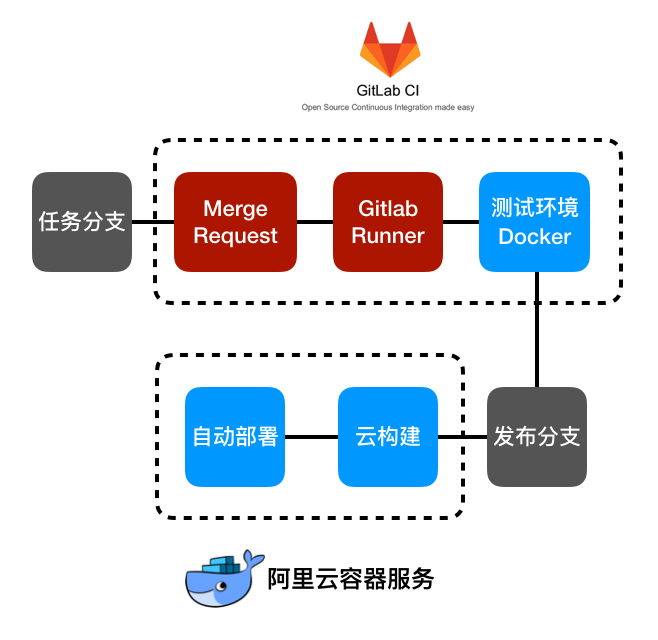

# 流程简介

1. [在任务分支上开发代码](#feature-branch)
2. [通过Merge Request，申请合并](#merge-request)
3. [通过对Gitlab CI的配置，Merge Request会触发Gitlab Runner去跑自动化任务](#gitlab-runner)
4. [Gitlab Runner启动指定的测试专用Docker去运行自动化测试](#gitlab-runner-executors)
5. [测试通过之后，将代码合并到master分支](#merge-master)
6. [阿里云容器仓库服务会检测到master分支的变更，开始构建新的docker镜像](#docker-build)
7. [阿里云容器服务会检测到docker镜像的变更，然后自动部署](#docker-deploy)

## 1. 在任务分支上开发代码

最基本的分支管理方案就是不要直接在主分支上做开发。那么从最基本的分支管理策略入手，在任务分支上先进行代码开发。

## 2. 通过Merge Request，任务分支申请合并Master

Merge Request是gitlab的术语，类似于Github的Pull Request。

Merge Request是两个分支的一次预合并，Gitlab CI可以对这个预合并后的代码进行测试， 测试完成之后才允许合并到Master。

这样就可以对Master分支进行保护，确保每次合并进来的代码满足预设的一系列条件。

## 3. 通过对Gitlab CI的配置，Merge Request会触发Gitlab Runner去跑自动化测试

Merge Request产生之后，会产生一个任务。Gitlab Runner接收到任务后就会去处理。

但是Gitlab Runner在这里只是起一个调度的作用，接收到请求后会呼叫Executor（执行者）去真正的执行编写的自动化任务。

## 4. Gitlab Runner启动指定的测试专用Docker去运行自动化测试

可以跑Gitlab自动化测试的的Executor有很多种，这里我们选择了用Docker作为Executor去跑自动化测试。

运行自动化测试用的Docker镜像是可以根据需求自行构建的。启动测试的时候启动这个镜像，跑完之后直接释放掉这个镜像。

这样每次测试的时候都是全新的干净的测试环境。特别当后面的运行环境也跑在Docker之内的时候，接近于真实环境的测试更具有优势。

自动化测试不限于单纯的测试，根据需要还可以加上代码风格审查这样的环节。

## 5. 测试通过之后，将代码合并到Master分支

Merge Request会显示出自动化测试的结果，如果自动化测试通过的话，可以把代码合并到Master分支了。

## 6. 阿里云容器仓库服务会检测到Master分支的变更，开始构建新的Docker镜像

通过比较简单的配置，阿里云容器仓库服务就可以和私有Gitlab整合，从指定仓库的Master分支获取代码，然后构建出镜像。

## 7. 阿里云容器服务会检测到docker镜像的变更，然后自动部署

通过比较简单的配置，容器仓库服务在构建完成之后就会触发容器服务的钩子，然后镜像之内的新代码就会有序更新到生产环境中去了。
